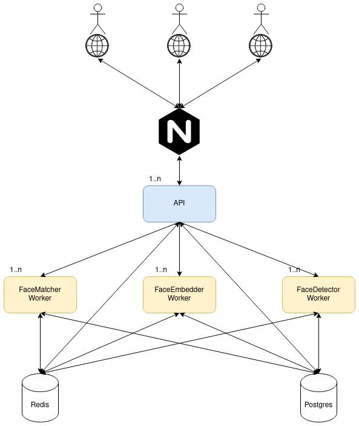

# Local Image Repository with AI-assisted Face Tagging

## Description

This software is designed to build an image repository of your photos and detect all of the people in them. You can also manually tag the people it finds, and your changes help the Neural Network improve its next predictions.

## Use cases

1. Event organizers can use this to identify the pictures that each participant is in, and share them.
2. People who want to enable face-based search in their own image folders.
3. Enterprise that must host everything locally and cannot use cloud providers for their face-tagging needs.
4. Enterprise that outsources face tagging for the AI models they build, and want a platform that makes this efficient.

## Features

* Images remain on your local computer, but can optionally be saved in a cloud of your choice.
* Because software runs on local network, everyone connected to the network can contribute to annotating faces.
* AI model runs locally and does not access the internet.
* AI model improves as users annotate images.

## Design

The challenges for this project are around efficiently managing a large number of different tasks that the backend needs to perform. These are:

* Running a CPU-intensive AI model (*FaceDetector*) that detects faces from images.
* Running a CPU-intensive AI model (*FaceEmbedder*) that converts faces to embeddings (i.e representing the face in a lower dimensional space, a vector of 512 real numbers).
* Comparing the embedding of a face (*FaceMatcher*) against the embeddings of all known people to find the closest pair of embeddings, and therefore the best guess for which person a face represents.
* Serving different requests to a user (*Backend API*), such as: serving individual faces when a user wants to tag faces, serving all images that match an individual, and many others.
* Designing a database efficiently as it needs to handle requests from the *FaceDetector*, the *FaceEmbedder*, the *EmbeddingsMatcher*, and the *Backend API*.
 
 In order to facilitate these requirements, several design choices are made:
 
 * The above are separated into different services, each in a different (Docker) container. This modularity simplifies the logic of the backend, and allows for the potential to scale each service separately and based on its needs. The AI Components(*FaceDetector* and *FaceEmbedder*) are especially heavy on resources. They can run locally, but they can also be deployed to remote servers with much more powerful CPUs or GPUs(which are recommended for faster inference). 
 * *FaceDetector*, *FaceEmbedder*, and *FaceMatcher* are service workers that consume jobs written to Redis (the message broker) by the *Backend API*. This allows most queries to the *Backend API* to be non-blocking, and makes the 3 services scaleable, since multiple workers of each type can be easily spun up. 
 * The database is a separate server that all of the services use to read and write information to.
 * The database handles paths to images instead of storing the images themselves. This has numerous advantages:
   * It significantly reduces the size of each individual query and therefore makes requests to the database significantly faster. This is important as the database can have a lot of requests made from different components at the same time. 
   * It gives a user the decision of where to store the images. The user can have the images locally and have the entire software runnning locally. Alternatively they can also save the images in the cloud, such as in an S3 bucket, and simply give the backend server the repository location and access rights.
 * In production mode, the backend runs behind NGINX which enables the backend to handle multiple parallel requests from numerous users. This is useful for cases when you will have a large number of people annotating images from the same repository, specifically use cases 1,3, and 4 (depending on number of people that will be annotating). Note that by default individual requests to the back-end are already reasonably fast because there are very few blocking calls. The main one is calls to the database, and because the database serves paths instead of images, calls to it are also relatively quick.
